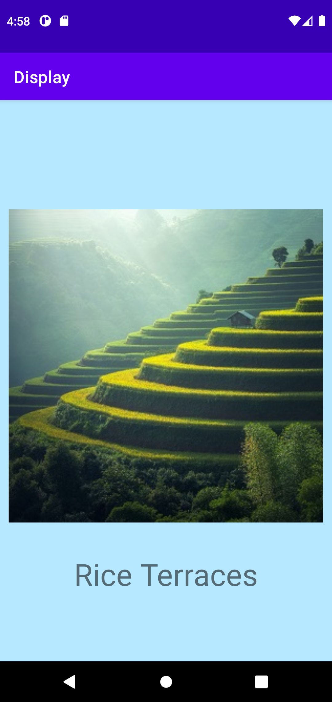
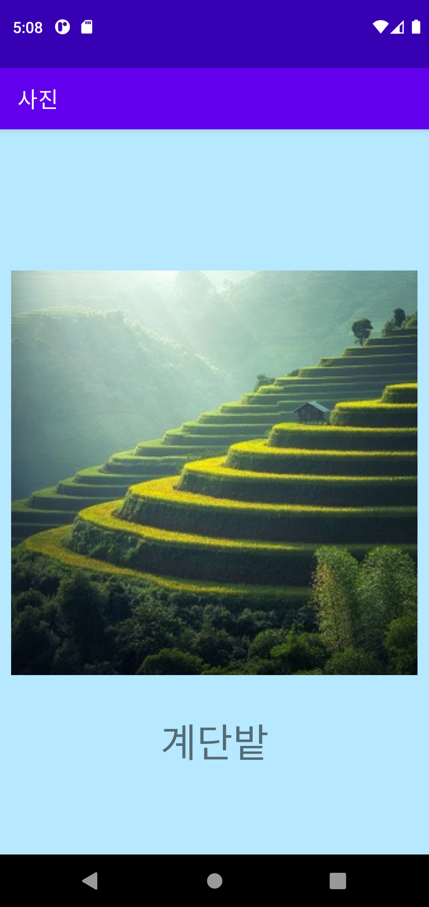
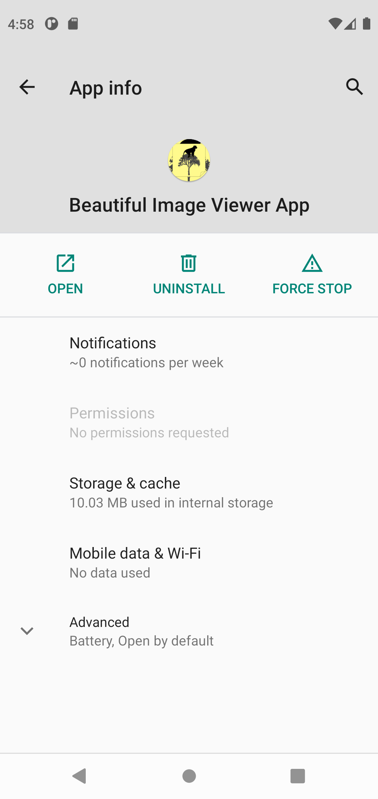
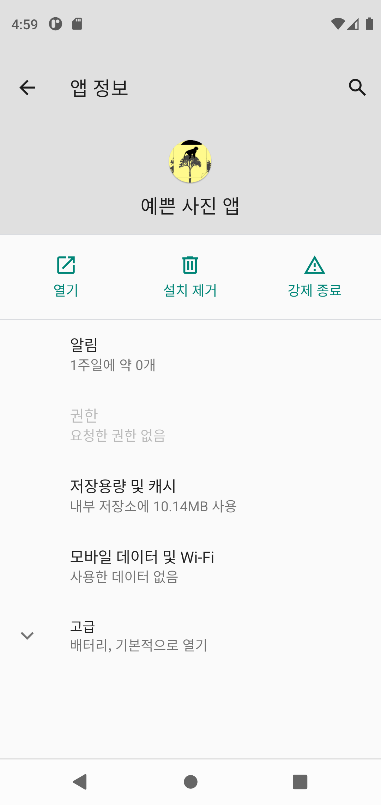

## Lab 5 : Selection Activity App with Locale Options
* For Introduction to Mobile Application Development

## About:
* Similar to Lab 4, order string variables/arrays into separate file, and use alternative resources to provide translation of app properties
* Korean used to provide locale example for this project

## Screenshots:
* Selection - English: 
* Selection - Korean: 
* Display - English: 
* Display - Korean: 
* App Info - English: 
* App Info - Korean: 

## Other Information:
* Last commit made: October 08, 2021