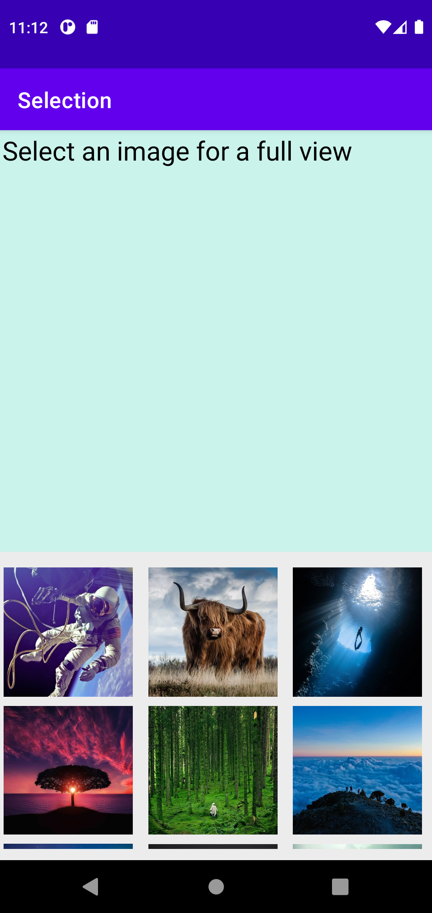
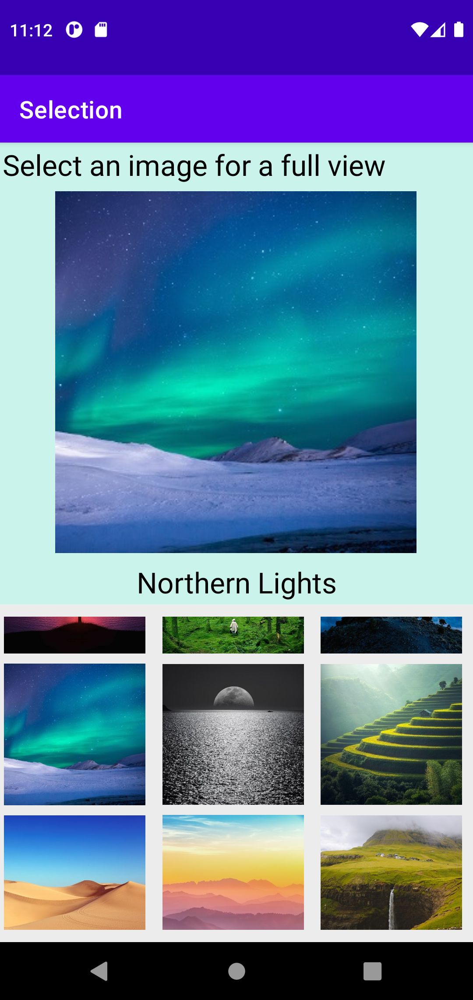

## Lab 6: Selection + Display Fragment Application
* For Introduction to Mobile Application Development

## About:
* Similar to Lab 4, using two fragments in main activity to display image and text, calling fragments using instances, and using ViewModel to facilitate display of app

## Screenshots:
* Before: 
* After: 

## Other Information:
* Last commit made: October 20, 2021 (excluding .apk file export)